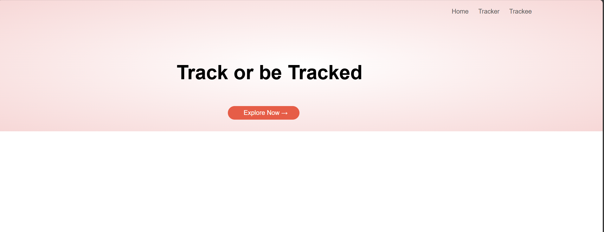
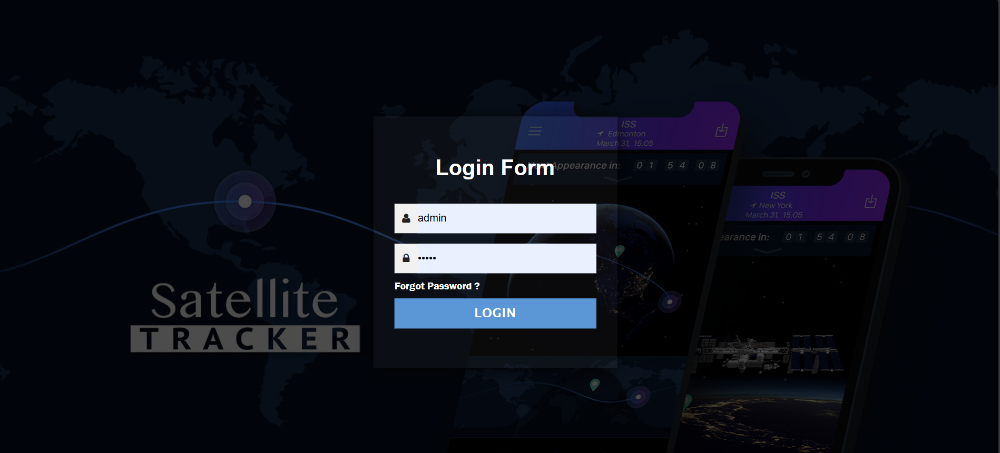
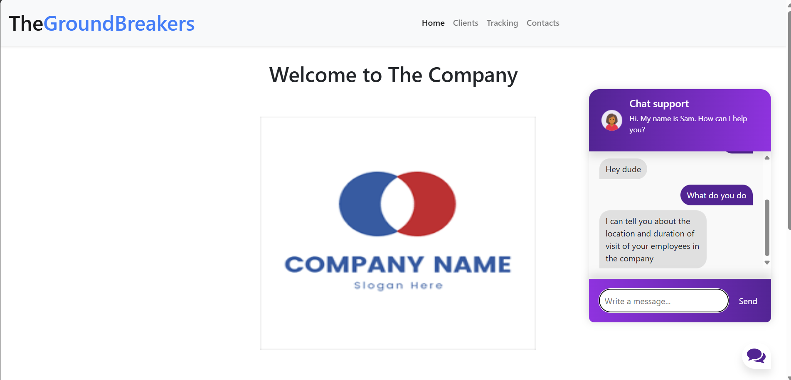
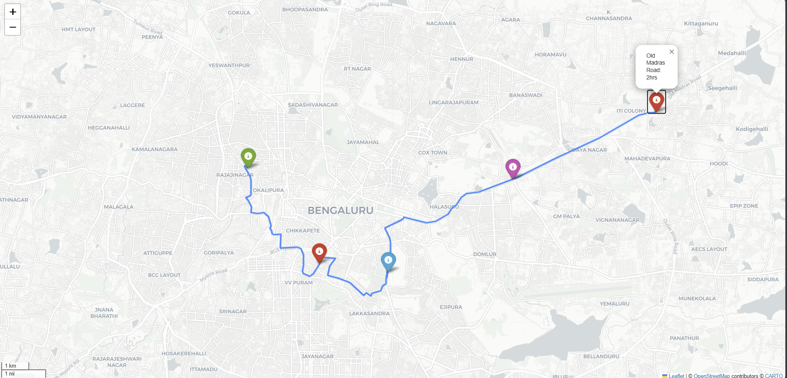

# Online-Delivery-Agent-Tracking-Route-Optimization

## Project Overview:
The Online Delivery Agent Tracking & Route Optimization project aims to streamline the delivery process through real-time tracking and optimized route planning for delivery agents. Additionally, it incorporates an advanced chatbot feature to provide immediate assistance and enhance user interaction.

## Key Features:

1. Delivery Agent Tracking: 
     a. Real-time tracking of delivery agents using geographical data to monitor their locations throughout the delivery process. 
     b. Integration with mapping tools like Folium for visual representation of agent movements and delivery routes.

2. Route Optimization: 
    a. Utilization of algorithms to optimize delivery routes based on factors such as traffic conditions, delivery priorities, and geographical constraints. 
    b. Enhancing efficiency and reducing delivery times by dynamically adjusting routes as per real-time data.
   
3. Advanced Chatbot: 
    a. Integration of a sophisticated chatbot using Flask and NLTK (Natural Language Toolkit) to facilitate seamless communication between users and the delivery system. 
    b. Capabilities include order tracking, delivery status updates, FAQs, and personalized assistance based on user queries.

4. User Interface: 
     a. User-friendly web interface powered by Flask for easy navigation and interaction with delivery tracking and chatbot functionalities. 
    b. Responsive design ensuring accessibility from both desktop and mobile devices.

5. Deployment and Scalability: 
    a. Deployment on cloud platforms for scalability and accessibility, ensuring smooth operation even under high user traffic. 
    b. Utilization of containerization technologies (e.g., Docker) for efficient deployment and management of application components.

## Technologies Used:
1. Folium: For interactive maps and geographical visualization of delivery routes and agent locations.
2. Flask: Web framework for developing the backend server and RESTful APIs to handle requests from the frontend and chatbot.
3. NLTK (Natural Language Toolkit): Integration for natural language processing tasks, including text tokenization, stemming, and chatbot responses generation.
4. Machine Learning: Implementing algorithms for route optimization and predictive analytics to enhance delivery efficiency.
5. Frontend Development: HTML, CSS, JavaScript for creating an intuitive and responsive user interface.
6. Database Management: Integration with databases (e.g., MySQL, MongoDB) for storing user data, delivery information, and chatbot logs.

## Output
1. Introduction Page 
2. Login Page 
3. Main Page with image of chatbot conversion 
4. Devlier Point with green tag being the location of the agent and the red tag being the end point 
